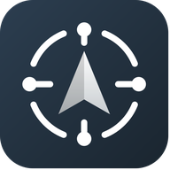

# GPSLink

<div align="center">



**High-precision GNSS bridging for Android — no root required.**

[](https://developer.android.com)
[](https://developer.android.com/about/versions/oreo)
[](LICENSE)
[](https://gradle.org)
[](https://www.u-blox.com)

</div>

---

## Overview

**GPSLink** is an Android utility that bridges external GNSS receivers — over USB or Bluetooth — directly into Android's mock location provider. It delivers centimeter-grade positioning to any location-aware application without requiring root access.

Whether you're working with professional survey-grade u-blox modules or consumer Bluetooth receivers, GPSLink handles device communication, NMEA parsing, and system-level location injection transparently.

---

## Table of Contents

- [Features](#features)
- [Screenshots](#interface-overview)
- [Supported Hardware](#supported-hardware)
- [Setup Guide](#setup-guide)
- [Project Architecture](#project-architecture)
- [Building](#building)
- [License](#license)

---

## Features

### Dual Connectivity

| Mode | Details |
| :--- | :--- |
| **USB Serial (u-blox)** | Native support for u-blox M7–M10 modules with automatic device configuration and binary UBX command support. |
| **Bluetooth Classic (SPP)** | Compatible with any NMEA-capable receiver over the Bluetooth Serial Port Profile. |

### Mock Location Engine

- **Seamless injection** of coordinates, altitude, speed, bearing, and accuracy into the system `LocationManager`.
- **System-wide compatibility** — works with Google Maps, navigation tools, and professional GIS applications.
- **Stale detection** — automatically halts injection when the signal is lost, preventing position drift.

### Real-Time Dashboard

- **Interactive mini-map** with live track visualization powered by OpenStreetMap (osmdroid).
- **Constellation signal bars** with per-satellite SNR and counts across GPS, GLONASS, Galileo, BeiDou, QZSS, and SBAS.
- **Precision compass** with dynamic heading needle and cardinal direction labels.
- **Collapsible NMEA terminal** with live sentence logging and throughput statistics (bytes/s, sentences/s).

### Advanced Configuration

- **Live update rate switching** between 1 Hz and 5 Hz via `UBX-CFG-RATE` commands — no reconnect required.
- **Auto-connect on USB attach** — the app can launch automatically when a compatible module is plugged in.
- **Persistent state** — remembers connection type, paired Bluetooth device, and last known position across sessions.

---

## Interface Overview

| UI Component | Description |
| :--- | :--- |
| **Status Indicator** | Pulsating green for active data flow, red for errors, grey for idle. |
| **Connection Card** | Displays device model, port, baud rate, and active update frequency. |
| **GNSS Card** | High-precision Lat/Lon, Altitude (MSL), Speed (km/h), and Course. |
| **Signal Quality** | HDOP and accuracy (±m) metrics refreshed once per second. |
| **Satellite Cards** | Separate tracking panels for satellites "In View" vs. "In Use". |
| **Mock Warnings** | In-app alerts when the Mock Location App setting is not configured. |

---

## Supported Hardware

### USB Receivers

Supports any u-blox receiver with USB Vendor ID `0x1546`:

| Module | Status |
| :--- | :--- |
| u-blox M10 | ✅ Fully supported |
| u-blox M9 | ✅ Fully supported |
| u-blox M8 | ✅ Fully supported |
| u-blox M7 | ✅ Fully supported |
| Other u-blox VID `0x1546` | ⚠️ Generic fallback |

### Bluetooth Receivers

Any device supporting the **Bluetooth Serial Port Profile (SPP)**, including:

- Bad Elf GPS Pro
- Dual XGPS series
- Garmin GLO
- Generic HC-05 / HC-06 SPP modules

---

## Setup Guide

### Prerequisites

- Android 8.0+ (API 26)
- Developer Options enabled on the device
- For USB: OTG-capable device and cable
- For Bluetooth: receiver paired via Android Settings

### Steps

**1. Enable Developer Options**

Navigate to `Settings → About Phone` and tap **Build Number** 7 times until you see the confirmation message.

**2. Set Mock Location App**

In `Settings → Developer Options`, locate **Mock location app** and select **GPSLink**.

**3. Grant Permissions**

On first launch, accept the following permissions when prompted:

- `ACCESS_FINE_LOCATION` — required for mock location injection
- `BLUETOOTH_CONNECT` / `NEARBY_DEVICES` — required for Bluetooth receivers

**4. Connect Your Receiver**

- **USB**: Connect via OTG cable. The app will prompt for USB host permission. Tap **OK** to grant.
- **Bluetooth**: Select your paired device from the dropdown in GPSLink, then tap **Start**.

> **Note**: If mock location injection fails, verify that GPSLink is still selected as the Mock Location App in Developer Options. This setting can reset after some system updates.

---

## Project Architecture

```
app/src/main/java/com/gpslink/
├── MainActivity.java          # Central UI controller and application state machine
├── UsbSerialService.java      # Foreground service for USB GNSS communication
├── BluetoothGpsService.java   # Foreground service for Bluetooth GNSS communication
├── NmeaParser.java            # Multi-constellation NMEA 0183 parsing engine
├── MiniMapView.java           # Real-time OSM path tracking component
├── CompassView.java           # Custom bearing/heading visualization
└── SignalBarsView.java        # Constellation-specific SNR chart views
```

The app follows a **Service → Parser → UI** data flow:

1. A foreground service (`UsbSerialService` or `BluetoothGpsService`) manages the hardware connection and streams raw bytes.
2. `NmeaParser` processes each sentence and emits structured fix objects.
3. `MainActivity` consumes fix data to update the mock location provider and refresh the dashboard UI.

---

## Building

### Requirements

| Tool | Version |
| :--- | :--- |
| Android Studio | Ladybug or newer |
| JDK | 17 |
| Android SDK | API 34 |
| Gradle | Wrapper included |

### Build Instructions

```bash
# Clone the repository
git clone https://github.com/your-org/gpslink.git
cd gpslink

# Build a debug APK
./gradlew assembleDebug

# Output: app/build/outputs/apk/debug/app-debug.apk
```

For a release build, configure your signing keystore in `gradle.properties` before running:

```bash
./gradlew assembleRelease
```

---

## License

Distributed under the **MIT License**. See [`LICENSE`](LICENSE) for full terms.

---

<div align="center">

Developed with care for the GNSS and open-source mapping community.

</div>
